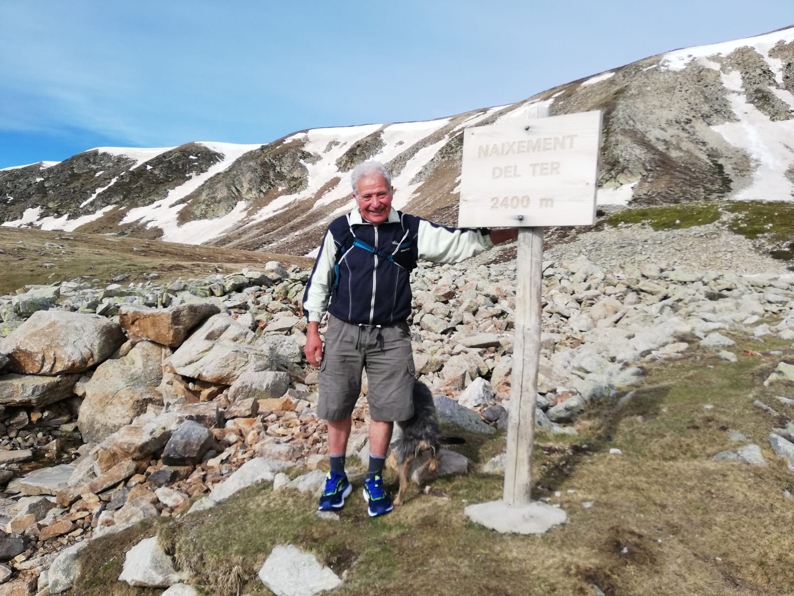

+++
date = '2025-08-10T15:30:05+02:00'
draft = false
title = 'Ruta del Aigua Viva'
+++

# Información y Bienvenida

Queridos senderistas. Nuestra intención al crear esta web, aparte de dar a conocer en la mayor amplitud posible la cuenca del río Ter, es que mediante el gozo y entusiasmo que podamos sentir recorriendo todos los senderos de nuestra ruta, propiciar la creación de otros nuevos que permitan seguir hasta los mas recónditos rincones del peculiar ecosistema que forman los río y arroyos a lo largo de todo su recorrido.

Es evidente que todo el equilibrio ecológico de los cursos del agua, ha estado, está y seguirá estando amenazado, si no somos capaces de crear una conciencia colectiva para su defensa integral y mantener las aguas vivas, que son la fuente de vida de todo el medio natural.
Para ello es imprescindible la promulgación de una ley integral que ampare en todos sus términos el objetivo de dar a conocer todo lo que ello significa y cubrir las múltiples carencias que existen en la actualidad así como las lagunas legales que permiten que puedan cometerse todo tipo de abusos, desde vertidos contaminantes hasta la apropiación privada de los terrenos colindantes que impiden el paso a todos los que pretendan conocer y recorrer los cursos del agua. La tarea de conseguir redactar un proyecto de ley tan ambicioso no compete sólo a unos pocos, sino que debe involucrar a todos los que podamos sentirnos afectados, sea cual sea la ideología política de cada persona.

Por eso, esta web debe estar y estará abierta a  que todos puedan aportar sus comentarios, sugerencias y enviarnos información que pueda ser publicada . A los que estén a favor para que puedan aportar todas sus ideas y experiencia y a los que estén en contra para que se pueda construir un proyecto limando todo tipo de asperezas e indirectamente fortaleciéndonos en nuestras convicciones. Lo peor que puede haber en este aspecto es la indiferencia que nos mantendría estancados en la nefasta  situación actual.
No cuestionamos la propiedad privada, pero creemos que hay bienes de utilidad pública que no se deben ni pueden privatizar, la servidumbre de paso por estos lugares es necesaria e imprescindible.

No somos propietarios de la naturaleza, sino que es la naturaleza la que nos posee a todos los seres vivientes. No tenemos ningún derecho a matar el agua que nos da la vida.
Los cursos del agua son los primeros caminos naturales que existen y han sido utilizados mucho antes de la propia existencia del hombre.
Encarecidamente solicitamos la ayuda y aportación de todo tipo de ideas, así como la colaboración con todas las entidades y personas que desde hace mucho tiempo están trabajando con esta misma finalidad.

En esta web se podrán crear enlaces con todas las que estén relacionadas. (por ejemplo, Consorcio del Ter, departamentos oficiales de turismo, deporte y educación, municipios de la ruta, Diputaciones, ACA, asociaciones excursionistas etc.etc.)
Esta tarea sabemos que es muy difícil, pero confiamos en que nuestro esfuerzo al recorrer a pié los 1000 kilómetros aproximados de esta ruta, se verá recompensado con el logro de nuestro objetivo, que no es otro que establecer un ley que nos ampare, si es posible a nivel europeo.
